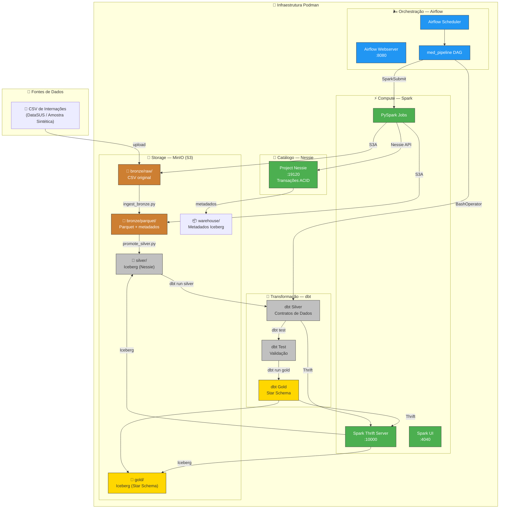
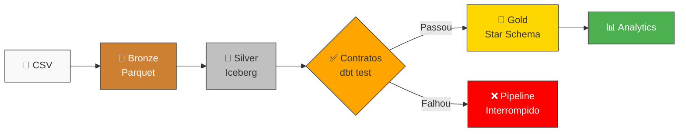
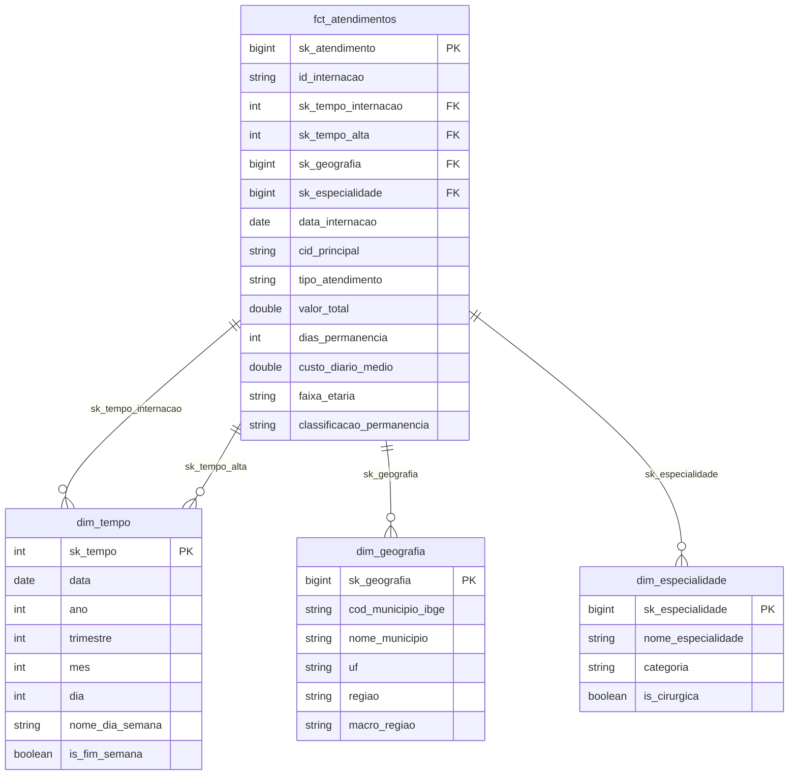

# 🏥 Lakehouse de Saúde — EMR Serverless Med Pipeline

Pipeline de dados de saúde utilizando arquitetura **Medallion (Diamond)** com **Apache Iceberg**, **Project Nessie**, **MinIO**, **dbt-spark** e **Apache Airflow**, emulando localmente um ambiente EMR Serverless da AWS via **Podman**.

---

## 📐 Arquitetura do Projeto



### Fluxo do Pipeline



### Modelo Dimensional (Gold — Star Schema)



---

## 🛠️ Stack Tecnológica

| Componente | Tecnologia | Porta | Descrição |
|------------|-----------|-------|-----------|
| **Storage** | MinIO | 9000/9001 | Emulação S3 com buckets bronze/silver/gold/warehouse |
| **Catálogo** | Project Nessie | 19120 | Metadados Iceberg com transações ACID (Git-like) |
| **Compute** | Spark 3.5 (Thrift Server) | 10000/4040 | Motor de processamento com suporte Iceberg |
| **Orquestração** | Apache Airflow 2.9 | 8080 | Agendamento e monitoramento do pipeline |
| **Transformação** | dbt-spark | — | Data Contracts e modelagem dimensional |
| **Formato** | Apache Iceberg | — | Tabelas analíticas com suporte a ACID e time-travel |

---

## 📋 Pré-requisitos

- **Podman** ≥ 4.0 com `podman-compose`
- **Python** ≥ 3.9 (para geração de dados de amostra)
- ~6-8 GB de RAM disponível

### Instalação do Podman (macOS)

```bash
brew install podman podman-compose
podman machine init --cpus 4 --memory 8192
podman machine start
```

---

## 🚀 Quick Start

### 1. Clone o repositório

```bash
git clone https://github.com/seu-usuario/emr-serverless-med-pipeline-iceberg.git
cd emr-serverless-med-pipeline-iceberg
```

### 2. Execute o pipeline completo

```bash
chmod +x pipeline.sh
./pipeline.sh
```

Ou para manter o ambiente ativo após a execução:

```bash
./pipeline.sh --skip-cleanup
```

### 3. Acompanhe pelos consoles

| Serviço | URL | Credenciais |
|---------|-----|-------------|
| MinIO Console | http://localhost:9001 | `minioadmin` / `minioadmin` |
| Airflow UI | http://localhost:8080 | `admin` / `admin` |
| Spark UI | http://localhost:4040 | — |
| Nessie API | http://localhost:19120 | — |

---

## 📁 Estrutura do Projeto

```
emr-serverless-med-pipeline-iceberg/
├── 📄 README.md                          # Este arquivo
├── 📄 .env                               # Variáveis de ambiente
├── 📄 .gitignore                         # Arquivos ignorados pelo Git
├── 📄 podman-compose.yml                 # Stack de infraestrutura
├── 🔧 pipeline.sh                        # Script CI/CD (5 estágios)
│
├── 🐳 docker/
│   ├── spark/
│   │   ├── Dockerfile                    # Spark 3.5 + Iceberg + Nessie JARs
│   │   └── spark-defaults.conf           # Configurações do catálogo
│   └── airflow/
│       ├── Dockerfile                    # Airflow + Spark + dbt
│       └── requirements.txt              # Dependências Python
│
├── ⚙️ conf/
│   └── minio/
│       └── init-buckets.sh               # Inicialização dos buckets
│
├── 📊 data/
│   └── sample/
│       └── internacoes_sample.csv        # Dataset sintético (~1020 registros)
│
├── ⚡ spark/
│   ├── jobs/
│   │   ├── config.py                     # SparkSession factory (env-var based)
│   │   ├── ingest_bronze.py              # Bronze: CSV → Parquet
│   │   └── promote_silver.py             # Silver: Parquet → Iceberg (MERGE INTO)
│   └── utils/
│       └── s3.py                         # Helpers S3A/MinIO (boto3)
│
├── 🔧 dbt_project/
│   ├── dbt_project.yml                   # Configuração do projeto dbt
│   ├── profiles.yml                      # Conexão Thrift → Spark
│   ├── packages.yml                      # Dependências (dbt_utils)
│   ├── models/
│   │   ├── silver/                       # Camada Silver (contratos)
│   │   │   ├── schema.yml                # Data Contracts
│   │   │   ├── stg_internacoes.sql       # Limpeza e padronização
│   │   │   └── stg_internacoes_dedup.sql # Deduplicação
│   │   └── gold/                         # Camada Gold (Star Schema)
│   │       ├── schema.yml                # Contratos Gold
│   │       ├── dim_tempo.sql             # Dimensão de Tempo
│   │       ├── dim_geografia.sql         # Dimensão de Geografia
│   │       ├── dim_especialidade.sql     # Dimensão de Especialidade
│   │       └── fct_atendimentos.sql      # Tabela de Fatos
│   └── tests/
│       └── assert_valid_cid.sql          # Validação formato CID-10
│
├── 🌬️ airflow/
│   └── dags/
│       └── med_pipeline_dag.py           # DAG completo do pipeline
│
└── 🔄 .github/
    └── workflows/
        └── ci.yml                        # GitHub Actions (lint + validação)
```

---

## 🔄 Estágios do Pipeline

O `pipeline.sh` executa 5 estágios em sequência:

| # | Estágio | Descrição | Ação em caso de falha |
|---|---------|-----------|----------------------|
| 1 | **SETUP** | Sobe MinIO, Nessie, Spark, Airflow | Para o pipeline |
| 2 | **INGEST** | `ingest_bronze.py` — CSV → Parquet | Para o pipeline |
| 3 | **VALIDATE** | `promote_silver.py` + `dbt run silver` + `dbt test` | **INTERROMPE** se contrato violado |
| 4 | **BUILD** | `dbt run gold` + `dbt docs generate` | Para o pipeline |
| 5 | **CLEANUP** | `podman-compose down -v` | Skip com `--skip-cleanup` |

---

## 📊 Dados de Amostra

O arquivo `data/sample/internacoes_sample.csv` contém **1020 registros** sintéticos simulando internações hospitalares (SIH/AIH), com:

- **15 hospitais** de 7 estados brasileiros
- **20 CIDs** principais (J18.9, I50.0, K35.8, etc.)
- **15 especialidades** médicas
- **Período**: 2023-2024
- **Problemas de qualidade intencionais** (~5%): case misturado, nulos, duplicatas, idades negativas

---

## 🔧 Configuração de Ambiente

### Variáveis de Ambiente

Todas as configurações são centralizadas no arquivo `.env`:

| Variável | Padrão | Descrição |
|----------|--------|-----------|
| `S3_ENDPOINT` | `http://minio:9000` | Endpoint do MinIO/S3 |
| `AWS_ACCESS_KEY_ID` | `minioadmin` | Access Key |
| `AWS_SECRET_ACCESS_KEY` | `minioadmin` | Secret Key |
| `NESSIE_URI` | `http://nessie:19120/api/v1` | URI da API Nessie |
| `SPARK_THRIFT_HOST` | `spark` | Host do Thrift Server |

### Migração para AWS S3 Real

Para trocar do MinIO para S3 real, altere apenas o `.env`:

```bash
# .env — Produção (AWS)
S3_ENDPOINT=https://s3.amazonaws.com
AWS_ACCESS_KEY_ID=<sua-access-key>
AWS_SECRET_ACCESS_KEY=<sua-secret-key>
AWS_REGION=us-east-1
NESSIE_URI=<seu-nessie-endpoint>
```

**Nenhuma alteração de código é necessária** — toda a configuração do Spark é lida por variáveis de ambiente via `spark/jobs/config.py`.

---

## 📝 Contratos de Dados (Silver)

A camada Silver implementa contratos rigorosos:

| Campo | Validação | Descrição |
|-------|-----------|-----------|
| `id_internacao` | `NOT NULL`, `UNIQUE` | Identificador único |
| `uf` | `ACCEPTED_VALUES` (27 UFs) | Unidade Federativa válida |
| `sexo` | `ACCEPTED_VALUES` (M, F, NI) | Sexo ou Não Informado |
| `tipo_atendimento` | `ACCEPTED_VALUES` | Tipo padronizado |
| `cid_principal` | Regex `^[A-Z]\d{2}\.\d+$` | Formato CID-10 válido |

Se qualquer contrato for violado, o pipeline é **interrompido automaticamente** antes de construir a camada Gold.

---

## 🧊 Configuração Iceberg + Nessie

As tabelas Iceberg são gerenciadas pelo catálogo Nessie com as seguintes configurações:

```properties
spark.sql.catalog.local.type=nessie
spark.sql.catalog.local.io-impl=org.apache.iceberg.aws.s3.S3FileIO
```

### Particionamento

- **Silver**: `months(data_internacao)` — otimiza consultas por período
- **Gold (fct_atendimentos)**: `months(data_internacao)` — alinhado com Silver

### Propriedades das Tabelas

```sql
TBLPROPERTIES (
    'write.format.default' = 'parquet',
    'write.parquet.compression-codec' = 'snappy',
    'commit.retry.num-retries' = '3'
)
```

---

## 🧹 Limpeza do Ambiente

```bash
# Derruba tudo e limpa volumes
podman-compose down -v --remove-orphans

# Remove imagens construídas
podman rmi $(podman images -q --filter reference='*spark*') 2>/dev/null || true
podman rmi $(podman images -q --filter reference='*airflow*') 2>/dev/null || true
```

---

## 📜 Licença

Este projeto é distribuído sob a licença MIT.

---

## 👨‍💻 Autor

Desenvolvido seguindo padrões de **Senior Data Engineer** com foco em:
- ✅ Idempotência em todas as operações
- ✅ Data Contracts para qualidade de dados
- ✅ Portabilidade MinIO ↔ AWS S3 via env vars
- ✅ Particionamento otimizado por data (months)
- ✅ Modelagem dimensional (Star Schema)
- ✅ Pipeline interrompível em caso de violação de contrato
